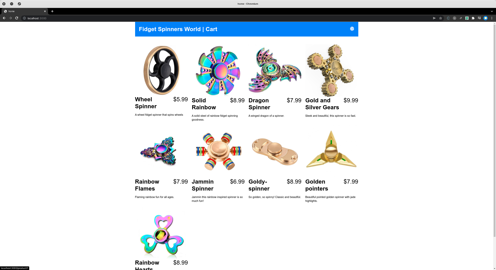
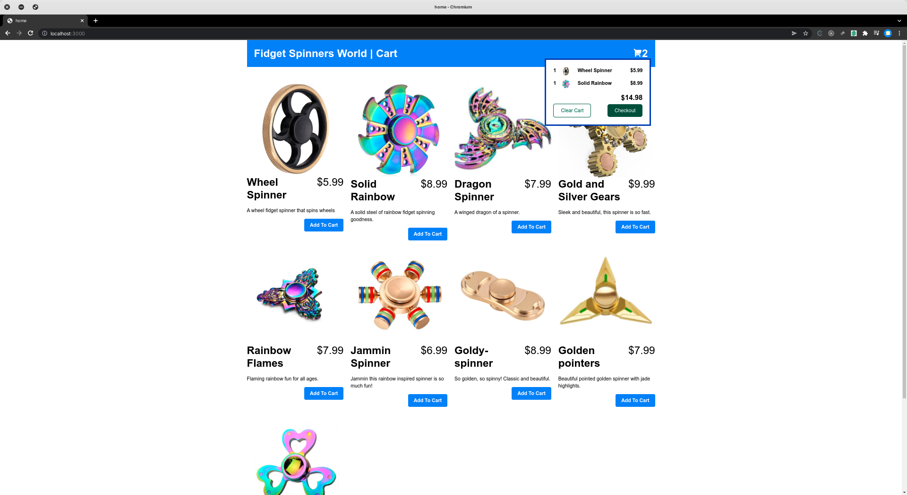
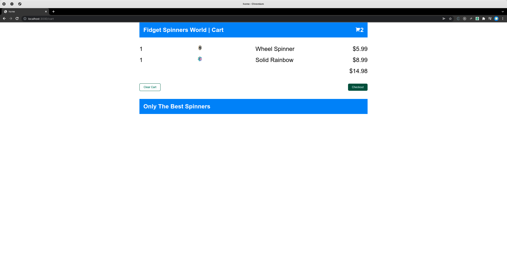

# Microfrontend with reactjs

## How to start

1. Install all dependencies in `/home`, `/pdp`, `/cart`, `/addcart` and `/server`
2. Start all FEs with `yarn start` and server with `yarn start:dev`
3. Open `http://localhost:3000`

  
  
Homepage

  

  
  
Homepage when logged in

  

  
  
Cartpage

